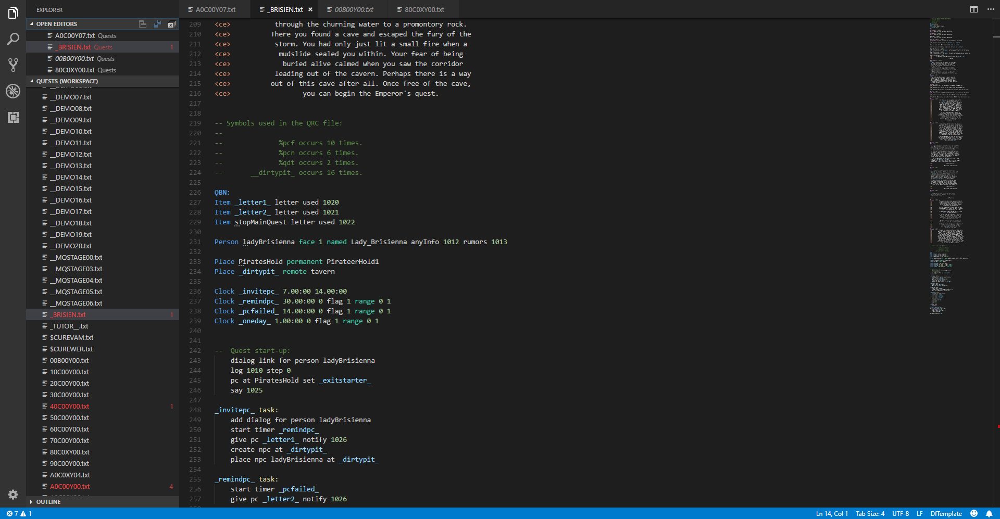

# TEMPLATE v1.11 extension for Visual Studio Code

A Visual Studio Code extension with support for Donald Tipton's _TEMPLATE 1.11_ language for Daggerfall (and [Daggerfall Unity](https://github.com/Interkarma/daggerfall-unity)!) quests.

## Quick start

1. Install the Template extension for Visual Studio Code from **Extensions > drop-down > [Install from VSIX](https://code.visualstudio.com/docs/editor/extension-gallery#_install-from-a-vsix)**.
2. Open a quest file and select **dftemplate** from the language indicator.

## Optional steps

3. Open a folder or create a workspace to set a file association (**files.associations**) to **dftemplate** for all quest txt files.

## Features

* Syntax highlighting
* Snippets
* Smart bracket matching
* Show Hovers
    + Show informations for symbols
    + Use comment block above symbol as a summary
* Completion proposals
    + Keywords, symbol definitions and action/condition invocations
    + Symbols based on action signature
    + Constants from quest tables
* Help with symbol and action/condition signatures
* Go to definition/Peek definition/Find all references
    + Symbols in quest file
    + Seek other quests in workspace
* Show all symbol and task definitions
* Show all quests in workspace
* CodeLenses with references and other details
* Rename symbols
    + Keep symbol variations (prefixes) in QRC block
* Format source code
    + Auto indent centered messages and tasks
    + Support format on type
* Diagnostics and action suggestions
    + Find issues with symbol definitions and action/condition invocations
    + Suggest symbol variations in QRC block
    + Find duplicated or unused declarations

## Language Data

### Tables

Quest data tables are read from local installation of Daggerfall Unity to provide completion suggestions and diagnostics features. If the workspace root path is not is not a subfolder of _StreamingAssets_, the absolute or relative path to _StreamingAssets/Tables_ must be set with **dftemplate.tablesPath**.

### Modules

Modules are json files that implement the [module schema](schemas/module.json) and provides signatures and documentation for actions and conditions.
Standard actions are already included with this extension but new modules can be imported with setting named **dftemplate.modules**.

-----------------------------------------------------------------------------------------------------------

-----------------------------------------------------------------------------------------------------------

### Links

* [TEMPLATE documentation](http://www.dfworkshop.net/static_files/questing-source-docs.html)
