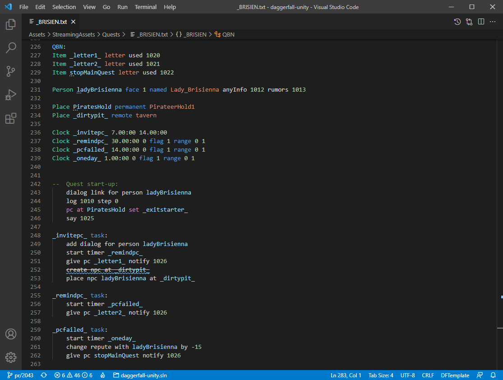

# TEMPLATE v1.11 extension for Visual Studio Code

A Visual Studio Code extension with support for Donald Tipton's _TEMPLATE 1.11_ language for Daggerfall (and [Daggerfall Unity](https://github.com/Interkarma/daggerfall-unity)!) quests.

## Quick start

1. Install the Template extension for Visual Studio Code from **Extensions > drop-down > [Install from VSIX](https://code.visualstudio.com/docs/editor/extension-gallery#_install-from-a-vsix)**.
2. Open **Preferences > Settings > User Settings** and set **dftemplate.tablesPath** to point to _StreamingAssets/Tables_.
3. Open the project folder or workspace, then from **Preferences > Settings > Workspace Settings** set files associations. For example, it may looks like this:

    ```json
    "files.associations": {
        "**/Quests/**/*.txt": "dftemplate"
    }
    ```

## Features

* Syntax highlighting
* Snippets
* Smart bracket matching
* Show Hovers
    * Show informations for symbols
    * Use comment block above symbol as a summary
* Completion proposals
    * Keywords, symbol definitions and action/condition invocations
    * Symbols based on action signature
    * Constants from quest tables
* Help with symbol and action/condition signatures
* Go to definition/Peek definition/Find all references
    * Symbols in quest file
    * Seek other quests in workspace
* Show all symbol and task definitions
* Show all quests in workspace
* CodeLenses with references and other details
* Rename symbols
    * Keep symbol variations (prefixes) in QRC block
* Format source code
    * Auto indent centered messages and tasks
    * Support format on type
* Diagnostics and action suggestions
    * Find issues with symbol definitions and action/condition invocations
    * Suggest symbol variations in QRC block
    * Find duplicated or unused declarations

### Commands and settings

| Command | Description |
| --- | --- |
| `DFTemplate: Toggle center token` | Switch between left and centered alignment for the selected message. |
| `DFTemplate: Generate messages` | Propose a list of static messages which are not defined inside current quest. |
| `DFTemplate: Order messages` | Reposition messages inside the QRC block according to numeric id. |
| `DFTemplate: Generate global variables` | Propose a list of global variables which are not defined inside current quest. |
| `Format Document` | Format code using the formatter provided by this extension. |

To configure the behaviour of this extension, open the [user or workspace settings](https://code.visualstudio.com/docs/getstarted/settings) and type ```DFTemplate```.

## Language Data

### Tables

Quest data tables are read from local installation of Daggerfall Unity to provide completion suggestions and diagnostics features. If the workspace root path is not is not a subfolder of _StreamingAssets_, the absolute or relative path to _StreamingAssets/Tables_ must be set with **dftemplate.tablesPath**.

### Modules

Modules are json files that provides signatures and documentation for actions, conditions and other modular language data. Standard actions are already included with this extension but additional modules can be imported from a folder named **Modules** in the workspace root directory, when their names are added to **dftemplate.modules**. For example `"Test/Foo"` makes data available from `/Modules/Test/Foo.dfmodule.json`. New module files can be easily created following the associated json schema.

-----------------------------------------------------------------------------------------------------------




-----------------------------------------------------------------------------------------------------------

### Links

* [TEMPLATE documentation](http://www.dfworkshop.net/static_files/questing-source-docs.html)
